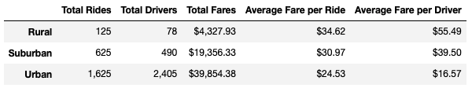
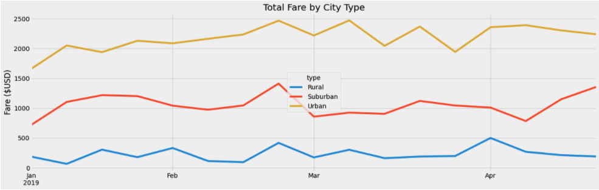

# PyBer Analysis

## Overview
The purpose of this analysis is to compare and visualize the far differences between rural, suburban and urban city types. By taking raw data from CSV files, we are able to help PyBer analyze their current rides and what they cost per ride and per available driver in each area.

## Analysis
From the below chart, we can see that the distribution of rides by city type uring this Jan-Apr timeframe are siginificantly skewed toward urban areas. This is not terribly surprising given that these are high population density areas and would have more activity as a result. This is supported by the much higher totals in total rides (1,625 out of a total of 2,375) and total drivers (2,405 out of the 2,973 total across the three city types. Suburban is second out of three in both of the aforementioned metrics as it would be the second-most population dense area, accounting for 625 of the 2,375 total rides and 490 of the 2,973 drivers. Rural follows in last for both metrics and it is the least-population dense of the three, representing only 125 rides of the 2,375 total and 78 of the 2,973 drivers.

These rides are also cheaper than any other city type on average. The average urban ride is only $24.53 compared to $34.62 in rural aread and $30.97 in suburban regions (see above chart). Again, this makes sense because urban rides are generally shorter distances within a city and take less time to complete. Although these rides are shorter, because the average fare is lower and there are so many drivers in urban areas, the average fare per driver is significantly lower as a result. The average fare per driver is only $16.57 in urban areas versus $39.50 in suburban areas and $55.49 in rural areas. The below graph illustrates the differences in these averages for each ride in each of the three city types over the four months in this analysis, where these trends hold true for the entirety of the four-month span, as we can tell from the lines never crossing one another.

## Summary

After completing this analysis I would make a few recommendations to the PyBer CEO. First, I would try to attract more drivers in rural areas, whether that is advertising in these areas to get new drivers, or showing the current urban drives these charts we developed throughout this analysis. You could tout the higher average fare per ride and fare per driver to attract people to the area and show them that they would be getting more money per ride and there would be far less competition for business as the total drivers are just a fraction of the totals in urban areas. In urban areas, drivers outnumber rides by a 5:4 ratio, whereas there are fewer drivers than rides, representing only a 3:5 driver to ride ratio.

Second, I'd recommend trying to attract more users in rural areas. Across the four month period we analyzed, there were only 125 rides taken in rural areas in this time period. This is less than 10 rides per week. When we recommend trying to get more drivers in this region, we also want to make sure there is sufficient business to accomodate all of these new rural drivers and keep them there with the higher average fares. They could advertise in these areas or provide discounts to new users in rural towns to incentive them to use their service and potentially become new, repeat users to add to their client base.

Finally, I'd tell the CEO to consider raising the minimum ride another couple dollars to increase revenue in urban areas. The average fare per ride is over $6 per ride cheaper than the next-higher city type. With such high volume in these areas, they already have a steady user base, but the average fare per driver is very low ($16.57 vs $39.50 in suburban areas and $55.49 in rural regions). Our first two recommendations will help even out some of the disparity here, but if they want to keep their urban drivers happy as they attract more in the rural areas, they would want to make sure these drivers are compensated for the time spent in traffic and less fuel-efficient mileage.
